Lastejobb for data om Norske fylker og kommuner ikke inklusive kartdata.

## Dataflyt

### Datakilder (takk til)

- [Kartverket](https://kartkatalog.geonorge.no/metadata/kartverket/administrative-enheter-kommuner/041f1e6e-bdbc-4091-b48f-8a5990f3cc5b)
- [Statistisk sentralbyrå](https://ssb.no)
- [Wikipedia](https://no.wikipedia.org)

## Utdatasett

Datasettet som er resultatet av lastejobben havner i repo [kommune](https://github.com/Artsdatabanken/kommune) og leses videre derfra av prosjekter som bruker datasettet.

### Leses av

- [nin-data-lastejobb](https://github.com/Artsdatabanken/nin-data-lastejobb)

### Bruk i sluttprodukter

- [Natur i Norge kart](https://github.com/Artsdatabanken/nin-kart-frontend)
- [Artsdatabanken åpne data](https://data.artsdatabanken.no/)
