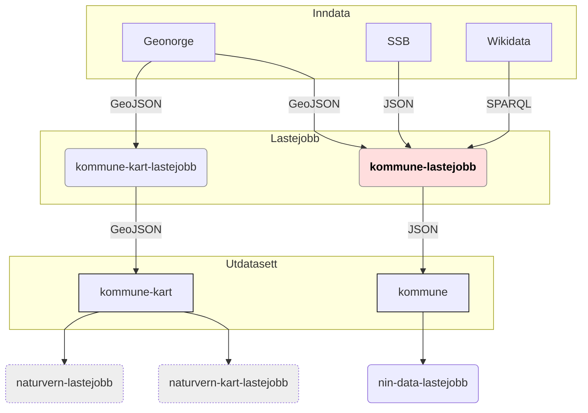

```mermaid

graph TB;
  linkStyle default interpolate monotoneX
    subgraph Inndata
      geonorge[Geonorge]
      wikidata[Wikidata]
      ssb[SSB]
    end
    subgraph Lastejobb
      kommune-kart-lastejobb(kommune-kart-lastejobb)
      kommune-lastejobb(kommune-lastejobb)
    end
    subgraph Utdatasett
      kommune-kart[kommune-kart]
      kommune[kommune]
    end
    geonorge-->|GeoJSON|kommune-kart-lastejobb;
    geonorge-->|GeoJSON|kommune-lastejobb;
    ssb-->|JSON|kommune-lastejobb;
    wikidata-->|SPARQL|kommune-lastejobb;
    kommune-kart-lastejobb-->|GeoJSON|kommune-kart;
    kommune-lastejobb-->|JSON|kommune;
    kommune-kart-->naturvern-lastejobb(naturvern-lastejobb);
    kommune-kart-->naturvern-kart-lastejobb(naturvern-kart-lastejobb);
    kommune-->nin-data-lastejobb(nin-data-lastejobb);
    click kommune-lastejobb "https://github.com/Artsdatabanken/kommune-lastejobb" "_"
    click xkommune "https://github.com/Artsdatabanken/kommune" "_"
    click kommune-kart "https://github.com/Artsdatabanken/kommune-kart" "_"
    click kommune-kart-lastejobb "https://github.com/Artsdatabanken/kommune-kart-lastejobb" "_"
    click geonorge "https://geonorge.no" "_"
    click wikidata "https://www.wikidata.org/wiki/Q15284" "_"
    click ssb "https://www.ssb.no" "_"

class kommune-lastejobb focus
class geonorge,wikidata,ssb data
class kommune,kommune-kart, utdata
class xkommune-lastejobb,kommune-kart-lastejobb lastejobb
class naturvern-lastejobb,naturvern-kart-lastejobb,nin-lastejobb-egenskaper next
classDef focusx stroke:#888,stroke-width:3px,font-weight:600;
classDef focus color:#000,fill:#ffdede,stroke:#888,stroke-widthx:3px,font-weight:600;
classDef data fillx:#ffd;
classDef lastejobb fillx:#fff,stroke:#888;
classDef utdata fillx:#ffa,stroke:#000;
classDef next fill:#eee,stroke-dasharray: 2, 2;

```
